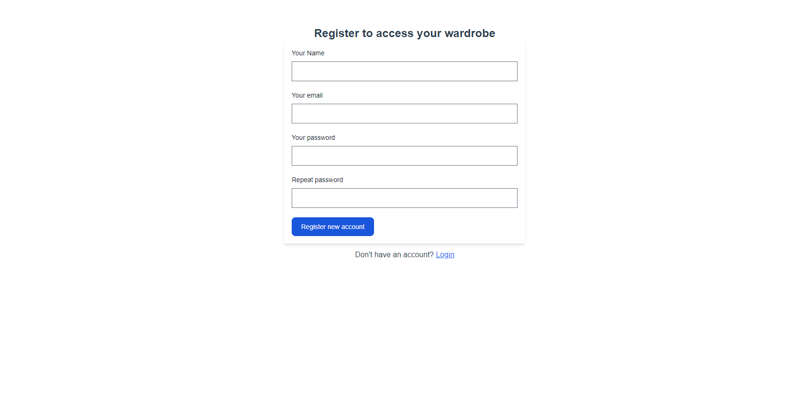
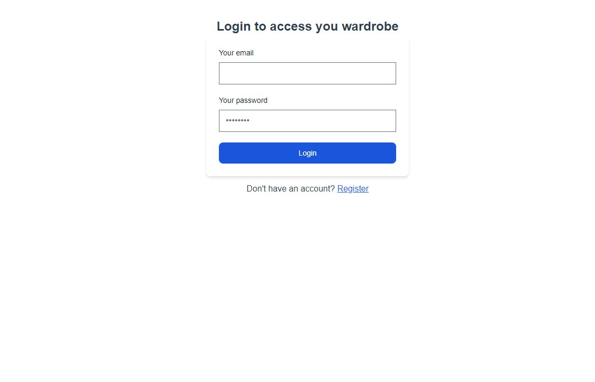
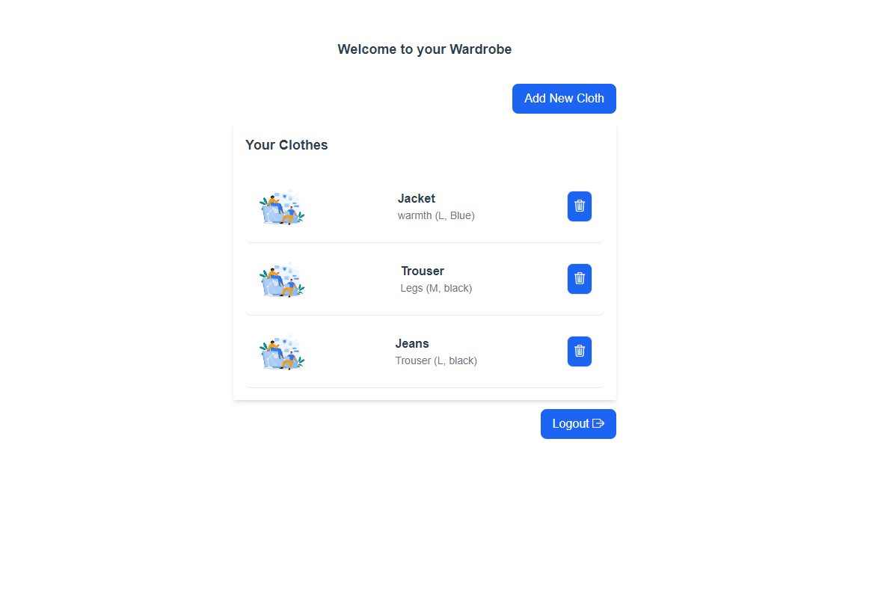

# Wardrobe Access Application 

This project is a wardrobe management system that allows users to register, log in, and manage their wardrobe items. The backend is built using Laravel APIs, while the frontend uses Vue.js and Tailwind CSS for the user interface.

## Repository Overview

- **Frontend Repository**: [wardrobe-management-front](https://github.com/uzapoint/wardrobe-management-front/tree/tamminga_budds)
- **Backend API Repository**: [wardrobe-management-system](https://github.com/uzapoint/wardrobe-management-system/tree/tamminga_budds)

## Technologies Used

- **Backend**: Laravel (PHP framework) for API development, authentication, and database management.
- **Frontend**: Vue.js (JavaScript framework) and Tailwind CSS for creating responsive user interfaces.

## Key Features

1. **User Registration**: Users can sign up by providing their name, email, and password.
   
   
   
2. **User Login**: Registered users can log in with their email and password to access their wardrobe.

   
3. **List of Clothes**: Logged in user can access their list of clothes in their wardrobes.
   

4. **Add and Update**: Registered users can add and update their clothes in their wardrobe.
   
3. **API Integration**: 
   - Laravel provides the backend APIs to manage user data, authentication, and wardrobe items.
   - The Vue.js frontend consumes these APIs for a seamless user experience.

4. **Responsive Design**: Tailwind CSS ensures the UI is fully responsive and looks great across different devices.

## Project Setup

### Backend (Laravel)

1. **Clone the repository**:
   ```bash
   git clone https://github.com/uzapoint/wardrobe-management-system.git
   git branch checkout tamminga_budds
   cd wardrobe-management-system
   ```
2. **Install Dependencies:**:
   ```
   composer install

   ```
3. **Environment Configuration:**:
Create a new ```.env``` file by copying ```.env.example```
   ```
   cp .env.example .env

   ```
4. **Generate Application Key:**:

   ```
   php artisan key:generate

   ```
5. **Run Database Migrations:**:

   ```
   php artisan migrate

   ```
## Tailwind CSS Customization

Tailwind CSS is used for styling the application. You can customize the design by modifying the `tailwind.config.js` file according to your needs.

## Folder Structure

### Backend (Laravel):

- `routes/api.php`: API route definitions.
- `app/Http/Controllers/`: Controllers handling API logic.
- `app/Models/`: Database models.

### Frontend (Vue.js):

- `src/components/`: Reusable Vue components.
- `src/views/`: Page-level views (e.g., `Login.vue`, `Register.vue`).
- `src/store/`: Vuex store for managing application state (e.g., authentication).

## Deployment

### Backend:

- Deploy the Laravel application on a PHP-supported server.
- Ensure the server is configured to run Laravel and manage the database connection.

### Frontend:

- Build the Vue.js application for production and deploy it to a static hosting platform like Netlify or Vercel.
- Ensure the frontend is correctly configured to communicate with the Laravel backend APIs.

   
